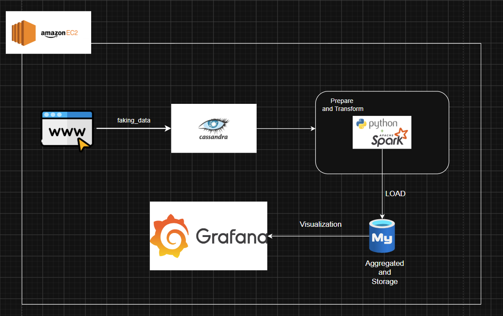
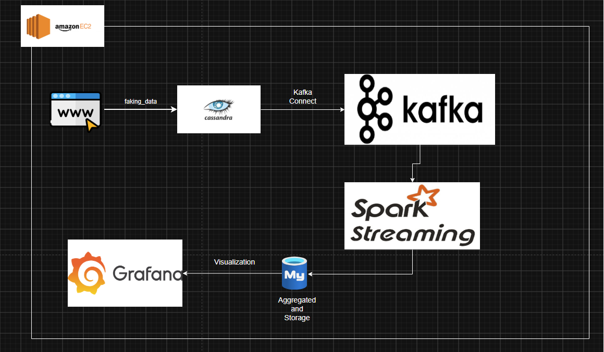

# Project Recruitment StartUp
> An event-driven, scalable ETL system designed to track candidate interactions (clicks, conversions) in near real-time/real time:
  1. Phase one: The project evolved from a common architecture using batch processing; the system now uses PySpark to build a near-real-time system.
  2. Phase two: The project evolved from a manual data collection architecture to a fully automated Change Data Collection (CDC) system using Kafka Connect, Apache   Kafka, and Spark Structured Streaming.

## OVERALL PIPELINE OVERVIEW


**1.Source(Cassandra):**  Stores raw event logs (e.g., user clicks on job postings) 

**2.Processing(PySpark):** Consumes the stream, aggregates metrics (pivoting rows to columns), and adds processing timestamps 

**3.Sink(MySQL):** Stores the final aggregated analytics for reporting 

**4.Visualization(Grafana):** A report to display for the user to view  

**5.Deloy(EC2 AWS):** Production Environment 


**1. Source (Cassandra)**  
   Stores raw event logs, such as user clicks on job postings.

**2. Ingestion (Kafka Connect)**  
   Uses the **Lenses.io Stream Reactor** plugin to poll Cassandra for new data using **TimeUUID watermarking** for CDC (Change Data Capture).

**3. Message Broker (Kafka)**  
   Buffers raw event data in the `tracking_topic`.

**4. Processing (Spark Streaming)**  
   Consumes the Kafka stream, deserializes JSON data, aggregates metrics by pivoting rows into columns, and adds processing timestamps.

**5. Sink (MySQL)**  
   Stores the final aggregated analytics data for reporting and dashboard visualization.

**6.Visualization(Grafana):** A report to display for the user to view  

**7.Deloy(EC2 AWS):** Production Environment  

## TECHNOLOGIES: 
| Category | Technologies |
|---|---|
| Programming | Python, PySpark |
| Data Processing | Apache Spark, Spark Streaming |
| Message Broker | Apache Kafka |
| NoSQL Database | Apache Cassandra |
| Relational Database | MySQL |
| Visualization | Grafana |
| Containerization | Docker, Docker Compose |
| Cloud | AWS EC2 | 

##  Project Structure

```text
├── docker-compose-kafka.yml   # Kafka infrastructure (Kafka, Zookeeper, Kafka Connect)
├── docker-compose.yml         # Database infrastructure (Cassandra, MySQL)
├── Dockerfile-connect         # Custom image with Lenses Cassandra Connector
├── app/kafka/streaming_job.py # Spark Structured Streaming job
├── app/kafka/producer.py      # Kafka Producer read CDC from Cassandra
├── requirements.txt           # Python dependencies
├── app/jobs/etl_pipeline.py   # Standalone ETL script with CDC logic
├── Dockerfile                 # Docker image for running ETL
├── images/                    # Screenshots and documentation images
└── README.md                  # Project documentation
```


   
