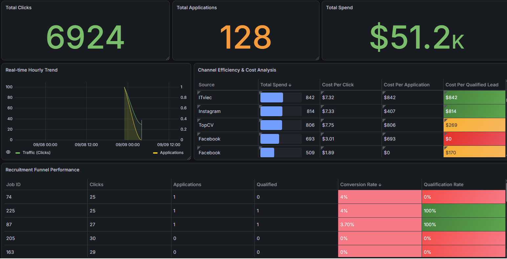

# Project Recruitment StartUp
> An event-driven, scalable ETL system designed to track candidate interactions (clicks, conversions) in near real-time/real time:
  1. Phase one: The project evolved from a common architecture using batch processing; the system now uses PySpark to build a near-real-time system.
  2. Phase two: The project evolved from a manual data collection architecture to a fully automated Change Data Collection (CDC) system using Kafka Connect, Apache   Kafka, and Spark Structured Streaming.

## OVERALL PIPELINE OVERVIEW
# Phase 1: Near Real Time


**1.Source(Cassandra):**  Stores raw event logs (e.g., user clicks on job postings) 

**2.Processing(PySpark):** Consumes the stream, aggregates metrics (pivoting rows to columns), and adds processing timestamps 

**3.Sink(MySQL):** Stores the final aggregated analytics for reporting 

**4.Visualization(Grafana):** A report to display for the user to view  

**5.Deloy(EC2 AWS):** Production Environment 

# Phase 2: Real Time Streaming with Kafka and Spark Streaming

**1. Source (Cassandra)**  
   Stores raw event logs, such as user clicks on job postings.

**2. Ingestion (Kafka Connect)**  
   Uses the **Lenses.io Stream Reactor** plugin to poll Cassandra for new data using **TimeUUID watermarking** for CDC (Change Data Capture).

**3. Message Broker (Kafka)**  
   Buffers raw event data in the `tracking_topic`.

**4. Processing (Spark Streaming)**  
   Consumes the Kafka stream, deserializes JSON data, aggregates metrics by pivoting rows into columns, and adds processing timestamps.

**5. Sink (MySQL)**  
   Stores the final aggregated analytics data for reporting and dashboard visualization.

**6.Visualization(Grafana):** A report to display for the user to view  

**7.Deloy(EC2 AWS):** Production Environment  

## TECHNOLOGIES: 
| Category | Technologies |
|---|---|
| Programming | Python, PySpark |
| Data Processing | Apache Spark, Spark Streaming |
| Message Broker | Apache Kafka |
| NoSQL Database | Apache Cassandra |
| Relational Database | MySQL |
| Visualization | Grafana |
| Containerization | Docker, Docker Compose |
| Cloud | AWS EC2 | 

##  Project Structure

```text
├── docker-compose-kafka.yml   # Kafka infrastructure (Kafka, Zookeeper, Kafka Connect)
├── docker-compose.yml         # Database infrastructure (Cassandra, MySQL)
├── Dockerfile-connect         # Custom image with Lenses Cassandra Connector
├── app/kafka/streaming_job.py # Spark Structured Streaming job
├── app/kafka/producer.py      # Kafka Producer read CDC from Cassandra
├── requirements.txt           # Python dependencies
├── app/jobs/etl_pipeline.py   # Standalone ETL script with CDC logic
├── Dockerfile                 # Docker image for running ETL
├── images/                    # Screenshots and documentation images
└── README.md                  # Project documentation
```
## Getting Started 
# Prerequisites 
- Docker and Docker Compose installed
- Apache Spark installed (for local submission)
- Python 3.x with pip

# 1. Start the Infrastructure 
Build the custom connector image and start all services: 

```bash
sudo docker compose up -d #Deploy DBs
sudo docker compose -f docker-compose-kafka.yml up -d --build
```
# 2. Deploy the Connector (CDC)
Once Kafka Connect is running, submit the configuration to start watching Cassandra. This uses KCQL to query only new rows based on `create_time`:
```bash
curl -X POST http://localhost:8083/connectors -H "Content-Type: application/json" -d '{
  "name": "lenses-cassandra-source",
  "config": {
    "connector.class": "io.lenses.streamreactor.connect.cassandra.source.CassandraSourceConnector",
    "connect.cassandra.key.space": "recruitment_startup",
    "connect.cassandra.contact.points": "localhost",
    "connect.cassandra.port": "9042",
    "connect.cassandra.username": "cassandra", 
    "connect.cassandra.password": "cassandra",
    "connect.cassandra.consistency.level": "ONE",
    "connect.cassandra.import.mode": "incremental",
    "connect.cassandra.poll.interval.ms": "1000",
    "connect.cassandra.kcql": "INSERT INTO tracking_topic SELECT * FROM tracking PK create_time INCREMENTALMODE=TIMEUUID"
  }
}'
```
# 3. Start the Spark Streaming Job
Run the PySpark job to listen to Kafka and aggregate data into MySQL:
```bash
spark-submit streaming_job.py
```
# 4. Trigger the Pipeline
```bash
python app/jobs/faking_data.py
```
## Real Time Dashboard 
The project includes a Grafana dashboard connected to MySQL for real-time visualization of recruitment performance metrics.
  
# Dashboard Components
**1. Executive Summary - KPI Metrics**
**Total Clicks**
```bash
SELECT 
  COALESCE(SUM(clicks), 0) as "Total Clicks"
FROM recruitment_startup.events
WHERE 
  $__timeFilter(updated_at)
```
**Total Applications**
```bash
SELECT COALESCE(SUM(conversion),0) as "Total Applications"
FROM recruitment_startup.events
WHERE $__timeFilter(updated_at) 
```
**Total Spend**
```bash
SELECT 
  COALESCE(SUM(spend_hour), 0) as "Total Spend"
FROM events
WHERE 
  $__timeFilter(updated_at) 
```
**2. Hourly Trends - Time Series Analysis**
**Create view in MySQL**
```bash
CREATE VIEW view_hourly_trend AS
SELECT 
    TIMESTAMP(CONCAT(dates, ' ', hours, ':00:00')) as metric_time,
    updated_at, 
    SUM(clicks) as traffic_volume,
    SUM(conversion) as application_volume
FROM events
GROUP BY 1, 2;
```
**Grafana Query:**
```bash
SELECT 
    metric_time as time,
    traffic_volume,
    application_volume
FROM view_hourly_trend
WHERE $__timeFilter(updated_at)
ORDER BY metric_time
```
**3. Marketing ROI - Cost Efficiency Analysis** 
Color-coded analysis identifying efficient (green) versus expensive (red) marketing channels based on Cost Per Qualified Lead (CPQL).
**Create view in MySQL**
```bash
CREATE VIEW view_marketing_roi AS
SELECT 
    p.publisher_name,
    e.publisher_id,
    e.dates,
    SUM(e.spend_hour) as total_spend,
    IF(SUM(e.clicks) > 0, SUM(e.spend_hour) / SUM(e.clicks), 0) as cpc,
    IF(SUM(e.conversion) > 0, SUM(e.spend_hour) / SUM(e.conversion), 0) as cpa,
    IF(SUM(e.qualified_application) > 0, SUM(e.spend_hour) / SUM(e.qualified_application), 0) as cpql
FROM events e
LEFT JOIN master_publisher p ON e.publisher_id = p.id
GROUP BY e.publisher_id, p.publisher_name, e.dates;
```
**Grafana Query:**
```bash
SELECT 
    publisher_name,
    total_spend,
    cpc as "Cost Per Click",
    cpa as "Cost Per Application",
    cpql as "Cost Per Qualified Lead"
FROM view_marketing_roi
WHERE dates >= CURDATE() - INTERVAL 7 DAY
ORDER BY cpql ASC
```
**4. Conversion Funnel - Job Performance**
**Create view in MySQL**
```bash
CREATE VIEW view_job_funnel AS
SELECT 
    job_id,
    dates,
    SUM(clicks) as total_clicks,
    SUM(conversion) as total_apps,
    SUM(qualified_application) as total_qualified,
    IF(SUM(clicks) > 0, (SUM(conversion) / SUM(clicks)) * 100, 0) as conversion_rate,
    IF(SUM(conversion) > 0, (SUM(qualified_application) / SUM(conversion)) * 100, 0) as qualification_rate
FROM events
GROUP BY job_id, dates;
```
**Grafana Query:**
```bash
SELECT 
    job_id,
    total_clicks,
    total_apps,
    total_qualified,
    conversion_rate,
    qualification_rate
FROM view_job_funnel
WHERE dates >= CURDATE() - INTERVAL 7 DAY
ORDER BY total_clicks DESC
LIMIT 20
```
## Future Improvements
Implement a Dead Letter Queue (DLQ) in Kafka for bad data


